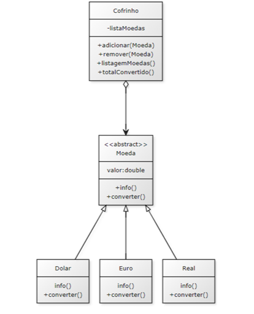
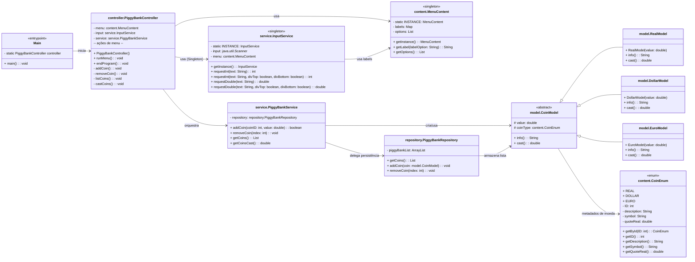

<h1 align=center>PROGRAMAÇÃO ORIENTADA A OBJETOS</h1>

<p align="center">
  
</p>

#
## 📚 Sobre

Repositório do trabalho semestral da disciplina **Programação Orientada a Objetos (POO)** – UNINTER, 2025. O projeto implementa um **sistema de Cofrinho de Moedas** em **Java**, com foco no bom uso de **Herança** e **Polimorfismo**.

***

## 🎯 Objetivo

Implementar um menu em console que permita:

*   **Adicionar** moedas de diferentes valores e países ao cofrinho
*   **Remover** moedas específicas
*   **Listar** todas as moedas
*   **Calcular** o total convertido para **Real (BRL)**

> A conversão é feita de forma polimórfica por cada tipo de moeda, usando cotações definidas em `CoinEnum`.

***

## 🧩 Requisitos do Trabalho

Para nota máxima, o projeto atende:

*   Algoritmo **completo, indentado e organizado**
*   **Comentários explicativos** no código
*   Exportação adequada do arquivo conforme indicado
*   Uso correto dos fundamentos de **Orientação a Objetos**, em especial **Herança** e **Polimorfismo**
  
<p align="center">
  
</p>

***

## 🏗️ Arquitetura

**Camadas e responsabilidades:**

*   **content/**
    *   `MenuContent` → Centraliza labels/mensagens e opções do menu (Singleton).
    *   `CoinEnum` → Enum de moedas: `REAL`, `DOLLAR`, `EURO` com **ID**, **descrição**, **símbolo** e **cotação** para BRL.
*   **model/**
    *   `CoinModel` → Classe **abstrata**, define `value`, `coinType` e os contratos `info()` e `cast()`.
    *   `RealModel`, `DollarModel`, `EuroModel` → Especializações; implementam `info()` e **conversão** (`cast()`).
*   **repository/**
    *   `PiggyBankRepository` → Lista mutável em memória (`ArrayList<CoinModel>`); adiciona, lista e remove por **índice**.
*   **service/**
    *   `PiggyBankService` → Regras de negócio (não aceita valores ≤ 0), instancia modelos e calcula o **total em BRL**.
    *   `InputService` → Entrada via console (valida `int`/`double`, exibe mensagens).
*   **controller/**
    *   `PiggyBankController` → Orquestra o fluxo do menu e delega às camadas de serviço/repositório.
*   **Main.java**
    *   Ponto de entrada que instancia o controller e inicia o menu.

> Observação: a aplicação usa um utilitário `IO` (referenciado em `InputService` e `PiggyBankController`) para abstrair `System.out.print/println`. Caso não esteja presente no seu ambiente, substitua por `System.out` ou adicione um utilitário simples.

***

## 📐 Diagrama UML (simplificado)



***

## 🧠 Como Funciona (Fluxo)

1.  **Main** inicia o `PiggyBankController`.
2.  O **menu** é exibido com opções e mensagens do `MenuContent`.
3.  As **entradas** do usuário são validadas pelo `InputService`:
    *   Inteiros para opção/IDs
    *   Decimais para valores monetários
4.  As ações invocam a **regra de negócio** no `PiggyBankService`, que:
    *   Valida o valor
    *   Instancia o modelo da moeda correta
    *   Persiste no `PiggyBankRepository`
5.  A listagem exibe todas as moedas com **índice** (`[ID: n]`) para remoção.
6.  O total em **BRL** é calculado somando o `cast()` de cada moeda.

***

## 🔧 Funcionalidades

*   **Adicionar moeda**
    *   Seleciona o tipo (`REAL`, `DÓLAR`, `EURO`)
    *   Informa o valor (positivo)
*   **Remover moeda**
    *   Informa o **índice** exibido na listagem (`[ID: n]`)
*   **Listar moedas**
    *   Exibe cada moeda via `info()` (descrição, símbolo e valor)
*   **Calcular total (BRL)**
    *   Soma `cast()` de todas as moedas e imprime `TOTAL EM REAL: R$ ...`
*   **Encerrar**
    *   Finaliza a aplicação com mensagem de término

***

## 🖥️ Exemplo de Uso (Console)

```text
--- SISTEMA DE COFRINHO ---
[1] - ADICIONAR MOEDA
[2] - REMOVER MOEDA
[3] - LISTAR MOEDAS
[4] - CALCULAR TOTAL EM REAL (R$)
[5] - ENCERRAR
-----------------------------------------
SELECIONE UMA OPÇÃO:
-----------------------------------------
--- (após escolher 1) ---
[1] - REAL
[2] - DOLAR
[3] - EURO
-----------------------------------------
SELECIONE UMA MOEDA:
-----------------------------------------
DIGITE O VALOR: € 10.00
-----------------------------------------
MOEDA ADICIONADA COM SUCESSO!
-----------------------------------------
--- (após escolher 3) LISTAR MOEDAS ---
[ID: 0] EURO | € 10.00
-----------------------------------------
--- (após escolher 4) CALCULAR TOTAL ---
TOTAL EM REAL: R$ 60.00
-----------------------------------------
--- (após escolher 5) ENCERRAR ---
*** PROGRAMA FINALIZADO ***
```

> **Notas importantes**
>
> *   Os “IDs” para remoção são os **índices** da lista mostrados em `[ID: n]`.
> *   As cotações atuais em `CoinEnum` (ex.: `USD = 5.0`, `EUR = 6.0`) são **fixas** e usadas na conversão para BRL.

***

## 💱 Conversão e Cotações

*   Cada `CoinModel` especializado implementa `cast()` usando a **cotação** de `CoinEnum`.
*   Para **atualizar cotações**, edite `CoinEnum.java`:
    ```java
    REAL(1, "REAL", "R$", 1.0),
    DOLLAR(2, "DOLAR", "$", 5.0),
    EURO(3, "EURO", "€", 6.0);
    ```
*   A abordagem fixa atende ao escopo acadêmico. Em cenários reais, recomenda-se buscar cotações via API e/ou configuração externa.

***

## 🧪 Validações e Regras

*   **Valores**: não permite inserir `≤ 0.0` ao adicionar moedas.
*   **Tipos de entrada**: `InputService` valida **inteiros** e **decimais**; mensagens claras são exibidas em caso de erro.
*   **Remoção**: ocorre por **índice**; remover um índice inexistente lança exceção do `ArrayList` (comportamento padrão do Java).

***

## 🧱 Decisões Técnicas

*   **Enum para moedas** (`CoinEnum`) com metadados → facilita exibição e conversão.
*   **Polimorfismo** em `cast()` → cada moeda sabe se converter para BRL.
*   **Repository em memória** → simples, suficiente para o trabalho.
*   **Menu e labels centralizados** (`MenuContent`) → separa apresentação de lógica.
*   **Serviço de entrada** (`InputService`) → evita duplicação de validações e melhora a UX.

***

## 🛠 Tecnologia

&nbsp;

***

## 🤝 Contribuição

```bash
git clone https://github.com/kaiquesouzasantoss/uninter-poo-piggybank.git
```
